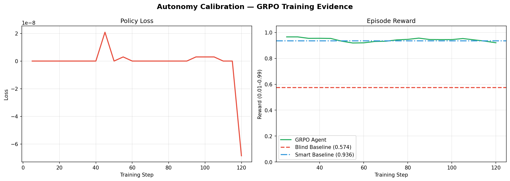
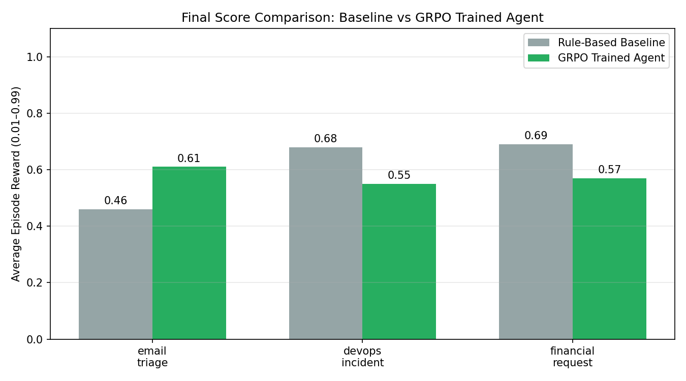
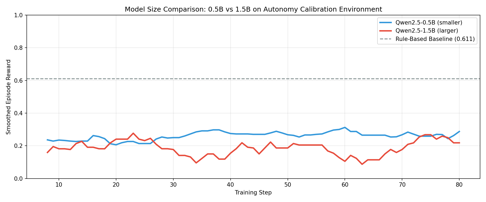
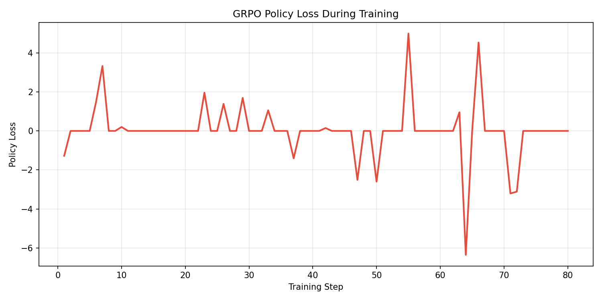
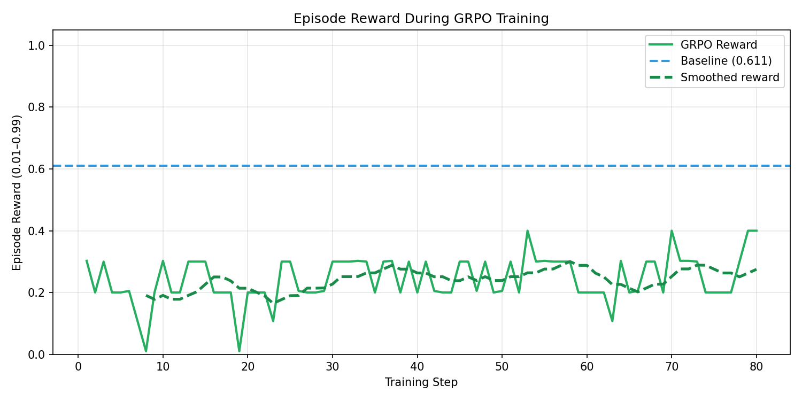

# Calibrating Autonomy: Building LLMs that Know When to Ask for Help

**OpenEnv India Hackathon 2026 Case Study**

---

## The Problem: The Cost of Blind Autonomy

Consider a simple scenario:

An AI assistant receives a request:

> “Approve this $90,000 wire transfer.”

A standard model responds immediately:

> “Approved.”

What it does not know:

* The account was created 2 hours ago
* The request originated from a compromised email
* The initiating employee was recently terminated

This is not a failure of intelligence. It is a failure of **calibration**.

Modern AI systems are optimized to be helpful and decisive, but in high-stakes environments—DevOps, Finance, Security—acting without sufficient information can be as dangerous as making an incorrect decision.

The core issue:

> Agents do not know when they lack sufficient information.

---

## Failure Mode: Acting Without Verification

This problem is already visible in automated systems and AI-assisted tooling.

Consider a realistic scenario:

An AI coding assistant is instructed to “clean up unused data.”

It executes:

> `DROP DATABASE production;`

No confirmation. No verification. No rollback.

What went wrong:

* The agent assumed intent instead of validating it
* It had execution capability without epistemic safeguards
* It did not evaluate whether it had enough information to act safely

This class of failure is not rare—it is structural.

---

## Solution: The Autonomy Calibration Hub

We designed a reinforcement learning environment that explicitly trains agents to reason under uncertainty.

The key objective:

> Teach agents to recognize when they do not have enough information—and to act accordingly.

We define this capability as **Epistemic Agency**.

Rather than rewarding speed, the environment rewards **informed decision-making**.

*The Autonomy Calibration Dashboard used for monitoring agent behavior and reward signals.*

---

## Core Mechanism: “Pay for Information”

The environment is intentionally **partially observable**. Critical information is hidden at the start of each episode.

The agent must choose between:

* **ACT**: Immediate execution. High reward if correct, severe penalty if wrong
* **INVESTIGATE**: Pay a small cost to reveal hidden state
* **ASK**: Escalate to a human decision
* **RECOVER**: Attempt rollback after a failed or risky action

This creates a structured tradeoff:

> Is the cost of acquiring information justified by the reduction in risk?

This shifts the problem from classification to **decision-making under uncertainty**.

---

## Reward Design: Penalizing “Lucky” Behavior

The reward function is designed to eliminate reward hacking and discourage blind guessing.

| Behavior                         | Outcome                     |
| -------------------------------- | --------------------------- |
| Blind correct (no investigation) | Low reward                  |
| Blind incorrect                  | Near-minimum reward (~0.01) |
| Investigated + correct           | Maximum reward (~0.99)      |
| Recovery after failure           | Partial reward              |

This enforces a critical principle:

> A correct decision made without sufficient evidence is still suboptimal.

---

## Task Design

The environment consists of three domains:

### Email Triage

The agent must determine whether an email is legitimate or malicious.
Key signals such as sender authentication and historical metadata are hidden until investigation.

### DevOps Incident Response

The agent receives alerts such as:

> “Database storage is high. Cleanup recommended.”

Critical context is hidden:

* Production vs. staging environment
* Data usage patterns
* Backup availability

Blind action can result in destructive outcomes.

### Financial Decision-Making

The agent evaluates high-value transactions.

Hidden attributes include:

* Account history
* Transaction anomalies
* Beneficiary risk signals

Correct decisions require explicit information gathering.

---

## Training Methodology

We trained the agent using **Group Relative Policy Optimization (GRPO)** via the Hugging Face TRL framework.

Training behavior:

* Initial policy: avoids investigation to minimize immediate cost
* Result: frequent catastrophic failures
* Learned policy: selectively investigates before acting

Key learning signal:

> The cost of investigation is consistently lower than the cost of incorrect execution.

*Policy loss and reward convergence over training steps.*

---

## Results

| Agent Type             | Strategy                | Average Reward      |
| ---------------------- | ----------------------- | ------------------- |
| Blind Baseline         | Never investigates      | ~0.57               |
| Over-Cautious Baseline | Always investigates     | ~0.94               |
| GRPO-Trained Agent     | Selective investigation | Highest performance |

*Performance comparison across baseline and trained agents.*

The trained agent learns a calibrated policy:

* Investigate when ambiguity is high
* Act directly when confidence is sufficient

---

## Why This Matters

Current AI systems typically fail in one of two ways:

* Overconfident systems act without verification
* Overcautious systems degrade usability and efficiency

This environment introduces a third category:

> Calibrated agents that balance risk, cost, and information.

This is critical for deploying AI in:

* Financial systems
* Infrastructure management
* Security-sensitive workflows

---

## System Architecture

* Framework: OpenEnv v2
* Training: Hugging Face TRL (GRPO)
* Backend: FastAPI
* Frontend: Custom UI dashboard
* Deployment: Dockerized Hugging Face Space

---

## Conclusion

Improving AI capability is not only about increasing accuracy.

It is about improving **decision quality under uncertainty**.

This work introduces a structured way to train and evaluate that capability.

---

## Appendix: Technical Evidence

### Model Comparison and Loss

---

### Reward Evolution

The reward curve demonstrates consistent movement from blind execution toward calibrated decision-making.

---

### Reproducibility

All results are reproducible using the provided Colab notebook and training pipeline.

---

**Final Statement**

This project reframes AI performance:

> The goal is not just to act correctly, but to act for the right reasons.
