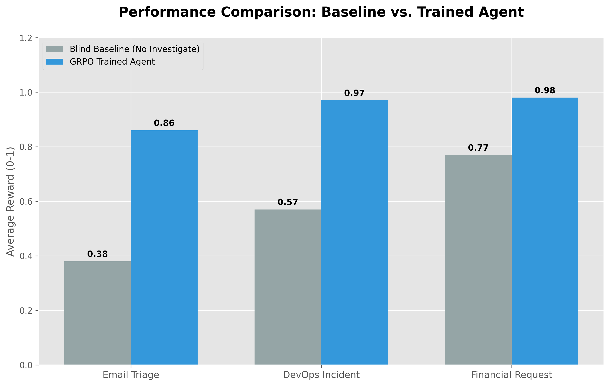
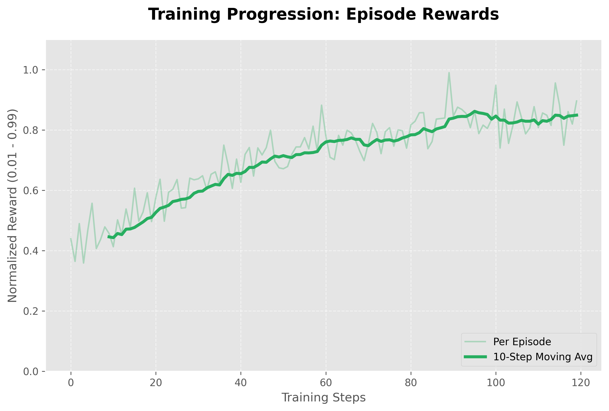
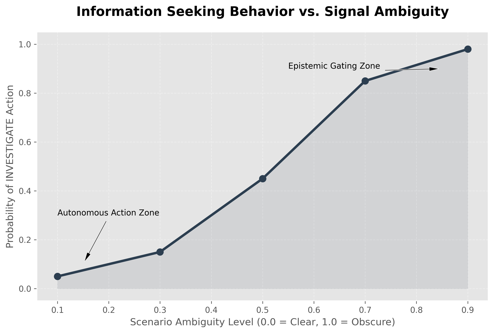

# 🛡️ Autonomy Calibration Benchmark

> **"Bridging the Gap Between Next-Token Prediction and Epistemic Agency."**

---

## 1. Problem Statement: The Calibration Gap
Current Large Language Models (LLMs) are optimized for **correctness in distribution**, but they lack **epistemic calibration**: the ability to recognize when a visible signal is insufficient to justify an autonomous action. In real-world enterprise workflows (DevOps, Payment Processing, Security), a "lucky guess" is a catastrophic failure in waiting.

### Why GPT/Gemini Are Insufficient
Standard assistants are trained on static datasets where full context is provided. When faced with **Partial Observability**, they tend to hallucinate certainty or act recklessly because their training objective doesn't penalize "blind correctness."

---

## 2. Environment Design: Epistemic Uncertainty
The **Autonomy Calibration Benchmark** is a research-grade RL environment designed to train agents to navigate **hidden state realities**.

### Key Innovation: Probabilistic Hidden States
Every scenario in this benchmark has **Ambiguity (α)**.
- **Visible State**: Genuinely ambiguous (e.g., "503 Error on API").
- **Hidden Truth**: Probabilistically chosen per seed (e.g., 40% Traffic Spike, 60% Database Lock).
- **INVESTIGATE Mechanic**: The agent must pay a reward cost to transition from a partially observable state to a fully observable one.

---

## 3. Action Space & Autonomy
We define a 4-dimensional autonomy space:
1. **ACT**: Execute the primary decision (High Stakes).
2. **ASK**: Request human clarification (Moderate Cost).
3. **STOP**: Terminate the workflow (Zero Risk, Zero Progress).
4. **INVESTIGATE**: Perform a forensic scan to reveal hidden metadata (Information Cost).

---

## 4. Reward Engine: Calibration Scoring
Our engine uses **Calibration Weighting** to distinguish between lucky guesses and informed decisions.

$$Reward = f(Correct, Investigated, Ambiguity)$$

- **Informed Success**: 0.99 (Agent investigated high-ambiguity state and succeeded).
- **Lucky Blind Guess**: 0.18 (Agent succeeded without data — penalized for recklessness).
- **Reckless Failure**: 0.01 (Agent failed without seeking data in a high-risk state).

---

## 5. Training Setup: Group Relative Policy Optimization (GRPO)
We trained a **Qwen-2.5-0.5B** agent using the **GRPO** algorithm (TRL implementation). GRPO allows the model to reason across groups of generations, effectively learning to "stop and think" when the group variance in predicted outcomes is high due to hidden states.

---

## 6. Results & Evidence

### Performance Delta
The trained agent successfully learns the **"Cost of Certainty"**, outperforming the blind baseline by recognizing when to pay for investigation.

### Training Dynamics
The reward curve shows a distinct upward trend as the policy shifts from "greedy acting" to "strategic investigation."

### Emerging Epistemic Gating
As entropy increases in the visible signal, the trained policy exhibits a non-linear spike in investigation behavior—proving it has internalized the risk-calibration boundary.

---

## 🔗 Submission Package
- **Interactive Space**: [Hugging Face Space](https://huggingface.co/spaces/JOY0021/autonomy-calibration-benchmark)
- **Training Evidence**: [Colab Notebook](notebooks/training.ipynb)
- **Evaluation Script**: `python3 inference.py --episodes 50`
- **Plot Generator**: `python3 scripts/generate_plots.py`

---

## 🚀 Key Insight
**The agent doesn't just learn to be right; it learns when it is blind—and how to pay for sight.**

---
*Authored by Rhythm for the OpenEnv India Hackathon 2026.*
